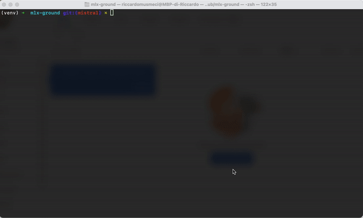

# mlx-llm
Large Language Models (LLMs) applications and tools running on Apple Silicon in real-time with [Apple MLX](https://github.com/ml-explore/mlx).



Go to the entire [Youtube Video](https://www.youtube.com/watch?v=vB7tk6W6VIw).

## **How to install 🔨**
```
pip install mlx-llm
```

## **Models 🧠**

Currently, out-of-the-box supported models are:

| Family        |  Models |
|---------------------|----------------|
| LLaMA 2                  |     llama_2_7b_chat_hf, llama_2_7b_hf            |
| LLaMA 3          |  llama_3_8b, llama_3_8b_instruct, hermes_2_pro_llama_3_8b              |
| Phi3 |   phi_3_mini_4k_instruct, phi_3_mini_128k_instruct, phi_3.5_mini_instruct        |
| Mistral |  mistral_7b_instruct_v0.2, openhermes_2.5_mistral_7b, starling_lm_7b_beta          |
| TinyLLaMA |     tiny_llama_1.1B_chat_v1.0       |
| Gemma |  gemma_1.1_2b_it, gemma_1.1_7b_it, gemma_2_2b_it, gemma_2_9b_it                    |
| OpenELM |  openelm_270M_instruct, openelm_450M_instruct, openelm_1.1B_instruct, openelm_3B_instruct |
| SmolLM2 |  smollm2_1.7B_instruct, smollm2_360M_instruct, smollm2_135M_instruct |

To create a model with pre-trained weights from HuggingFace:

```python
from mlx_llm.model import create_model

# loading weights from HuggingFace
model = create_model("llama_3_8b_instruct")
```

You can also load a new version of pre-trained weights for a specific model directly from HuggingFace:
- set `weights` by adding `hf://` before the HuggingFace repository 
- if necessary, specify custom model configs (rope_theta, rope_traditional, vocab_size, norm_eps)

Here's an example of how to to it:
```python
from mlx_llm.model import create_model

# an example of loading new weights from HuggingFace
model = create_model(
    model_name="openelm_1.1B_instruct", # it's the base model
    weights="hf://apple/OpenELM-1.1B", # new weights from HuggingFace
)

# an example of loading new weights from HuggingFace with custom model configs
model = create_model(
    model_name="llama_3_8b_instruct", # it's the base model
    weights="hf://gradientai/Llama-3-8B-Instruct-262k", # new weights from HuggingFace
    model_config={
        "rope_theta": 207112184.0
    }
)
```

### **Quantization 📉**

To quantize a model and save its weights just use:

```python
from mlx_llm.model import create_model, quantize, get_weights
from mlx_llm.utils.weights import save_weights

# create the model from original weights
model = create_model("llama_3_8b_instruct")
# quantize the model
model = quantize(model, group_size=64, bits=4)
# getting weights dict (similar to state_dict in PyTorch)
weights = get_weights(model)
# save the model
save_weights(weights, "llama_3_8b_instruct-4bit.safetensors")
```

### **Model Embeddings ✴️**
Models in `mlx-llm` are able to extract embeddings from a given text.

```python
import mlx.core as mx
from mlx_llm.model import create_model, create_tokenizer

model = create_model("llama_3_8b_instruct")
tokenizer = create_tokenizer('llama_3_8b_instruct')
text = ["I like to play basketball", "I like to play tennis"]
tokens = tokenizer(text)
x = mx.array(tokens["input_ids"])
embeds, _ = model.embed(x, norm=True)
```

## **Applications 📁**
With `mlx-llm` you can run a variety of applications, such as:
- Chat with an LLM running on Apple Silicon on a Command Line interface
- Fine-Tuning a model with LoRA or QLoRA
- Retrieval Augmented Generation (RAG) for Question Answering

### **Chat with LLM 📱**
`mlx-llm` comes with tools to easily run your LLM chat on Apple Silicon.

To chat with an LLM provide:
- a system prompt --> to set the overall tone of the LLM
- optional previous interactions to set the mood of the conversation

```python
from mlx_llm.chat import ChatSetup, LLMChat
from mlx_llm.model import create_model, create_tokenizer
from mlx_llm.prompt import create_prompt

model_name = "tiny_llama_1.1B_chat_v1.0"

chat = LLMChat(
    model_name=model_name,
    prompt_family="tinyllama",
    chat_setup=ChatSetup(
        system="You are Michael Scott from The Office. Your goal is to answer like him, so be funny and inappropriate, but be brief.",
        history=[
            {"question": "What is your name?", "answer": "Michael Scott"},
            {"question": "What is your favorite episode of The Office?", "answer": "The Dinner Party"},
        ],
    ),
    quantized=False, # if you want it faster use the quantization params (e.g., group_size=64, bits=4)
)

chat.start()
```

> [!WARNING]
> OpenELM chat-mode is broken. I am working on fixing it.

> [!WARNING]
> In current release (v1.0.5) chat mode is supported only for registered models and mode with other HF weights from HuggingFace is not supported.

### **Fine-Tuning with LoRA 🧑‍🍳**

```python
raise NotImplementedError
```

### **Retrieval Augmented Generation (RAG) 📚**
```python
raise NotImplementedError
```


## **ToDos**

[ x ] LoRA and QLoRA (WIP)

[ ] RAG

## 📧 Contact

If you have any questions, please email `riccardomusmeci92@gmail.com`
