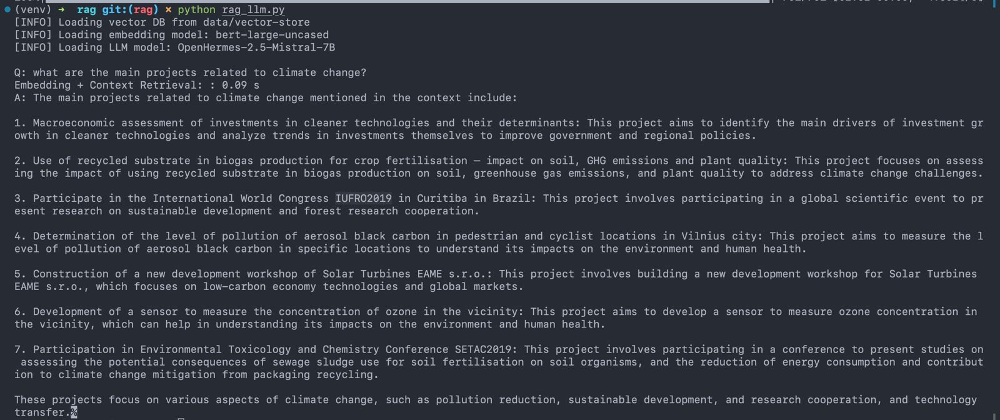

# **mlx-llm examples 🧑‍💻**

## **Chat with LLM 🗣️**

This example demonstrates how to chat with a language model using the `mlx-llm` library. Supported personalities:
- Dwight K Schrute (The Office)
- Coder (an AI coder))

You can easily add personalities in *chat/personality.py* file.

Here's an example of how to chat with Dwight K Schrute and OpenHermes-2.5-Mistral-7B:

```bash
cd examples/chat

python chat_llm.py \
    --personality dwight \
    --model OpenHermes-2.5-Mistral-7B \
    --tokenizer mlx-community/OpenHermes-2.5-Mistral-7B \ # can be a local path to a tokenizer.model file
    --max_tokens 500
```

## **RAG 📁**

Before starting, you must have a JSON file with your data in it structured as the one in *rag/data/kohesio_PO_budget_0-10000.json*.

Anyway, it is a simple list of dictionaries, where each dictionary has the following mandatory keys:

```json
[
    {
        "content": "content",
        "page": 0,
        "source": "top_(0, 10000).csv"
    }
]
```

To store the data, since this is my playground, I implemented a custom vector-DB (why not? 😅). It's pretty easy and it's not fancy, but it works just fine.

By running the following command, you can store your data with the embeddings from [`bert-large-uncased`](https://huggingface.co/mlx-community/bert-large-uncased-mlx):

```bash
python create_kb.py \
    --output-dir PATH/TO/VECTOR-DB \
    --data PATH/TO/DOCUMENTS.json \
    --model bert-large-uncased \
    --max_tokens 512
```

After that, you can enjoy your RAG application with [OpenHermes-2.5-Mistral-7B](https://huggingface.co/mlx-community/OpenHermes-2.5-Mistral-7B) by running the following script:

```bash
python rag_llm.py \
    --embedding-model bert-large-uncased \
    --vector-db PATH/TO/VECTOR-DB
```

You can apply these steps with the data in *rag/data/kohesio_PO_budget_0-10000.json* and check by yourself how it works.



> [!WARNING]
> * I tested this example with a small dataset, so I don't know how it will behave with a large one. If you have any issues, please let me know.
> * You can use any other LLM model, but you must be able to build the prompt properly.
